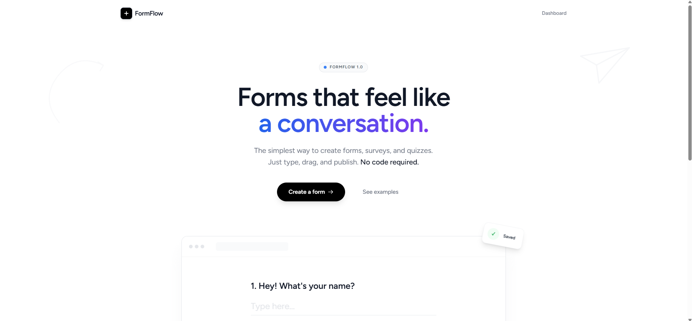

# FormFlow

Modern Laravel/Inertia form builder with shareable public forms, dynamic JSON-driven fields, and authenticated response management. Built for a better alternative to classic static form workflows.

## Interface Preview


## Features

- Create reusable online forms with custom structure
- Store form structure as JSON for dynamic field rendering
- Generate public links for unauthenticated form submission
- Authenticate users to manage forms and view results
- Track submitted responses per form
- Support identifier field, status, and expiration controls
- Built with Laravel, Inertia.js, and Vite

## Tech Stack

- PHP / Laravel
- Inertia.js
- Vite
- MySQL / database migrations
- Laravel authentication scaffolding
- Eloquent models: `Form`, `Response`, `User`

## Installation

```bash
git clone <repo-url>
cd formflow
composer install
npm install
cp .env.example .env
php artisan key:generate
# configure DB settings in .env
php artisan migrate
npm run dev
php artisan serve

